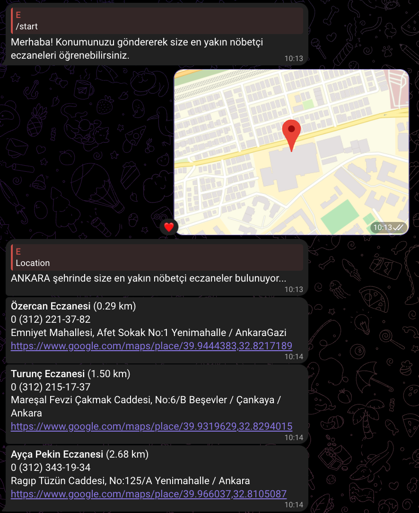

# eczane-bot
 

Konumunuza en yakın nöbetçi eczanelerin bilgilerini öğrenmek için hazırlanmış açık kaynak Telegram bot projesi.


## Nasıl Çalışıyor

- Telegram üzerinden gönderilen konumun koordinatlarını çıkarıyor.
- Hazırladığım [turkeyDistricts.json](https://github.com/lilmirac/eczane-bot/blob/main/turkeyDistricts.json) dosyasını kullanarak bulunduğunuz koordinatlara en yakın 3 ilçeyi buluyor.
- [eczaneler.gen.tr](https://www.eczaneler.gen.tr) üzerinden bu ilçeler için nöbetçi eczane araması yapıyor.
- Bulunan nöbetçi eczanelerden konumunuza en yakın 4 eczanenin bilgilerini ve konumlarını size gönderiyor.


## Ekran Görüntüleri




  
## Değişkenler

Bu projeyi çalıştırmak için aşağıdaki ortam değişkenini .env dosyanıza eklemeniz gerekecek.


`TELEGRAM_BOT_TOKEN`

  
## Docker ile Local Kurulum

Projeyi klonlayın

```bash
  git clone https://github.com/lilmirac/eczane-bot.git
```

Proje dizinine gidin

```bash
  cd eczane-bot
```
[Buradan](https://t.me/BotFather) oluşturduğunuz Telegram botunuzun tokenini .env dosyasına `TELEGRAM_BOT_TOKEN` değişkenini olarak ekleyin

Projeyi docker ile buildleyin

```bash
  docker build -t eczane-bot .
```

Projeyi çalıştırın

```bash
  docker run eczane-bot
```

  
## Destek

Destek için contact@mirac.dev adresinden ulaşabilirsiniz.

  
## Lisans

[MIT](https://github.com/lilmirac/eczane-bot/blob/main/LICENSE)

  
